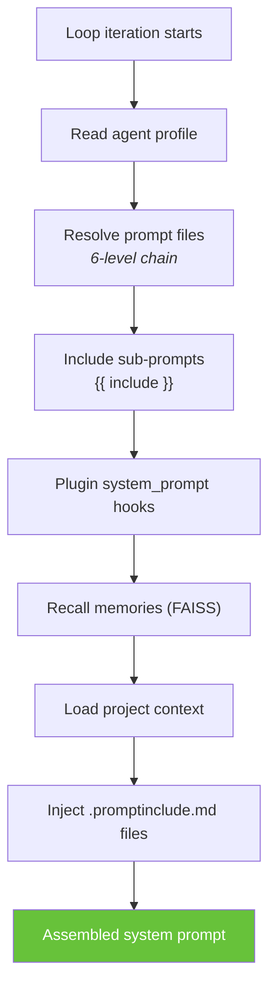

[← Home](../00-Home.md) | [↑ README](../README.md)


# The Agent Loop (Monologue Cycle)

## Overview

Each agent runs a continuous **monologue loop**. On each cycle:

1. Agent receives its current context (system prompt + message history + extras)
2. Agent produces a **JSON response**: `thoughts`, `headline`, `tool_name`, `tool_args`
3. Framework executes the named tool
4. Tool result is appended to history
5. Loop continues until agent calls `response` (final answer to superior)

## JSON Response Format

Every reply must contain:

```json
{
    "thoughts": ["reasoning steps"],
    "headline": "short summary",
    "tool_name": "tool_name",
    "tool_args": {"key": "value"}
}
```

- All keys and string values use **double quotes**
- No markdown fences around JSON
- `thoughts` is routing logic only (3-8 words per entry)

## Context Assembly



The assembled prompt is built dynamically each loop iteration from:
- `prompts/agent.system.main.md` (includes sub-prompts via `{{ include "filename.md" }}`)
- Agent profile overrides (resolved via 6-level chain)
- Plugin system prompts (via `system_prompt` extension point)
- Recalled memories (injected into `extras_persistent`)
- Active project context (`.a0proj/instructions/` auto-injected)
- `.promptinclude.md` files from working directory

## Extension Hooks in the Loop

```mermaid
graph LR
    A[message_loop_start] --> B[message_loop_prompts_before]
    B --> C[system_prompt]
    C --> D[message_loop_prompts_after]
    D --> E[before_main_llm_call]
    E --> F[reasoning_stream]
    F --> G[response_stream]
    G --> H{Has tool call?}
    H -->|Yes| I[tool_execute_before]
    I --> J[tool_execute_after]
    J --> K[hist_add_tool_result]
    K --> L[hist_add_before]
    L --> M[message_loop_end]
    H -->|No - response| M
    M --> N{More turns?}
    N -->|Yes| A
    N -->|No| O[monologue_end]

    style A fill:#67c23a,color:#fff
    style E fill:#2d8cf0,color:#fff
    style H fill:#e6a23c,color:#fff
    style O fill:#f56c6c,color:#fff
```



### Hook Reference Table

| Point | When | Common Use |
|-------|------|------------|
| `message_loop_start` | Loop begins | State injection, reset |
| `message_loop_prompts_before` | Before prompt assembly | Modify available prompts |
| `system_prompt` | During prompt assembly | Inject system-level instructions |
| `message_loop_prompts_after` | After prompt assembly | Inject additional context |
| `before_main_llm_call` | Before LLM API call | Modify params, inject messages |
| `reasoning_stream` / `_chunk` / `_end` | During reasoning | Telemetry, real-time processing |
| `response_stream` / `_chunk` / `_end` | During response | Telemetry, processing |
| `tool_execute_before` | Before tool execution | Validation, sandboxing |
| `tool_execute_after` | After tool execution | Auditing, transformation |
| `hist_add_before` | Before adding to history | Filter, transform |
| `hist_add_tool_result` | After tool result | Log, audit |
| `message_loop_end` | Loop iteration complete | Teardown |
| `monologue_start` / `monologue_end` | Monologue boundaries | Setup, cleanup |

## Related Pages
- [Multi-Agent Hierarchy](../01-Architecture/Multi-Agent-Hierarchy.md) — How agents delegate to subordinates
- [Prompt System](../04-Prompts/Prompt-System.md) — How prompts are assembled each loop iteration
- [Extension Points](../03-Plugins/Extension-Points.md) — Lifecycle hooks that fire during the agent loop
- [Tools Reference](../06-Tools/Tools-Reference.md) — Available tools in each loop iteration
