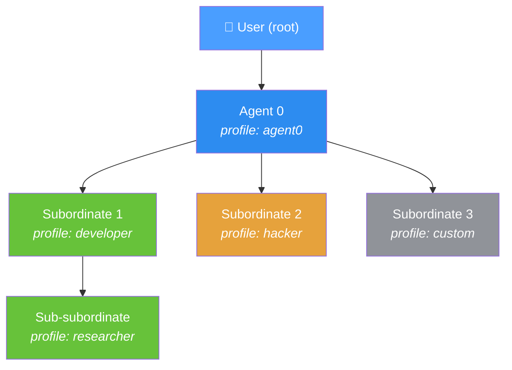

[← Home](../00-Home.md) | [↑ README](../README.md)


# Multi-Agent Hierarchy

## Structure

The hierarchy is a **tree** with the human user at the root:



## Key Concepts

- **Agent 0** is always the top-level agent whose superior is the user (regardless of whether you chose a different agent profile, a0 is the "level" of the agent)
- Each node is an agent instance running in its **own `AgentContext`**
- A superior calls `call_subordinate` with a message and optional profile name
- Subordinates can themselves delegate further — **no enforced depth limit**
- Agents share the same tool system but each has **isolated context and history**

## Delegation Pattern

```json
{
    "tool_name": "call_subordinate",
    "tool_args": {
        "profile": "developer",
        "message": "You are a Python expert. Refactor this module...",
        "reset": true
    }
}
```

- `reset: true` — first message or changing profile (fresh context)
- `reset: false` — continuing conversation with existing subordinate
- Subordinates have **no access to parent history** — everything they need must be in `message` or accessible via their own tools

## Built-in Profiles

| Profile | Title | Specialty |
|---------|-------|-----------|
| `default` | Default | Base template, no specialisation |
| `agent0` | Agent 0 | Main user-facing agent |
| `developer` | Developer | Software development, debugging, refactoring |
| `researcher` | Researcher | Research, data analysis, reporting |
| `hacker` | Hacker | Cybersecurity, penetration testing |

## Creating Custom Profiles

See [Profile Guide](../02-Agent-Profiles/Profile-Guide.md)

## Related Pages
- [Agent Loop](../01-Architecture/Agent-Loop.md) — The loop that drives each agent iteration
- [Profile Guide](../02-Agent-Profiles/Profile-Guide.md) — Defining agent profiles and personas
- [Tools Reference](../06-Tools/Tools-Reference.md) — Tools available to all agents
- [call_subordinate](../06-Tools/Tools-Reference.md) — The delegation tool
