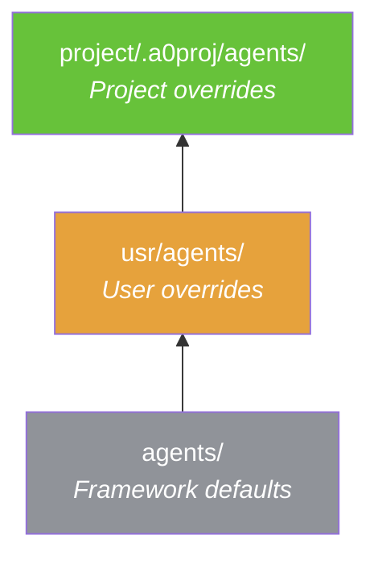
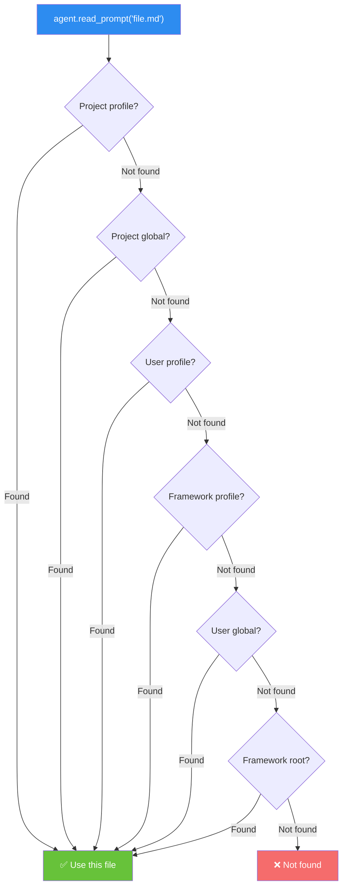

[← Home](../00-Home.md) | [↑ README](../README.md)


# Project Context System

## Overview

Projects provide **isolated workspaces** with their own memory, agents, prompts, and configuration. When a project is active, its context is injected into the agent's system prompt.

## Project Structure

```
usr/projects/<project-name>/
├── .a0proj/
│   ├── project.json          # Project metadata
│   ├── agents.json           # Agent toggle state
│   ├── agents/               # Project-scoped agent profiles (highest priority)
│   │   └── <profile>/
│   │       ├── agent.yaml
│   │       └── prompts/
│   ├── instructions/         # Auto-injected instructions
│   │   ├── 01-bmad-config.md
│   │   └── 02-bmad-state.md
│   ├── memory/               # Project-scoped FAISS indexes
│   │   └── index.faiss.sha256
│   ├── knowledge/            # Project-scoped knowledge files
│   ├── prompts/              # Project-scoped prompt overrides
│   └── secrets_registry.yaml
├── workdir/                  # Project working directory
└── ...                       # Your project files
```

## Resolution Hierarchy

Resources are resolved with **project > user > framework** priority:



> **Project > User > Framework** — highest priority wins.

### Prompt Resolution Chain



**First match wins.** The root `prompts/` folder provides defaults for ALL profiles.

## Per-Project Agent Toggles

Control which agents are available per project via `.a0proj/subagents.json`:

```json
{
    "developer": { "enabled": true },
    "researcher": { "enabled": false },
    "my_custom_agent": { "enabled": true }
}
```

## Auto-Injected Instructions

Files in `.a0proj/instructions/` are **automatically injected** into the system prompt every turn. Use for:
- Project-specific rules and conventions
- Phase tracking (BMAD state files)
- Configuration that must always be visible

## `.promptinclude.md` Files

Any `*.promptinclude.md` file in the **working directory** is auto-injected into the system prompt. These persist across conversations.

Use for:
- Environment context
- Development guidelines
- Tool preferences
- Project notes

> **Important:** Preference changes must be persisted to file before responding — never just acknowledge verbally.

## Related Pages
- [Directory Map](../01-Architecture/Directory-Map.md) — Full directory layout of Agent Zero
- [Knowledge System](../05-Memory-and-Knowledge/Knowledge-System.md) — Project-scoped knowledge directories
- [Settings](../07-Configuration/Settings.md) — `.promptinclude.md` auto-injection mechanism
- [Memory System](../05-Memory-and-Knowledge/Memory-System.md) — Per-project memory isolation
