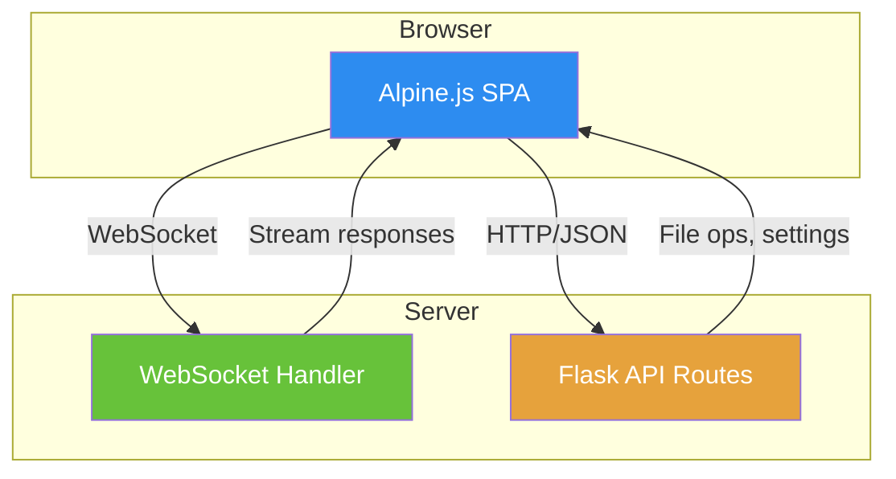
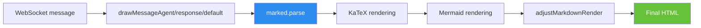

[← Home](../00-Home.md) | [↑ README](../README.md)


# WebUI Guide

## Overview

Agent Zero provides a **web-based chat interface** for interacting with the agent. The WebUI is a vanilla JavaScript single-page application using Alpine.js for reactivity, with no build system.



## Directory Structure

```
webui/
├── index.html              # Main SPA entry point
├── js/
│   ├── alpine-init.js      # Alpine.js initialization
│   ├── messages.js          # Message rendering pipeline
│   └── settings.js          # Settings page logic
├── css/
│   └── messages.css         # Chat message styles
├── vendor/                  # Local JS libraries
│   ├── marked/              # Markdown parser
│   ├── katex/               # LaTeX rendering
│   ├── mermaid/             # Diagram rendering (plugin)
│   └── ace/                 # Code editor
├── components/              # UI components
│   └── messages/
│       └── process-group/   # Process grouping
└── assets/
```

## Key Features

| Feature | How |
|---------|-----|
| Markdown rendering | marked.js with custom extensions |
| LaTeX math | KaTeX post-processing |
| Mermaid diagrams | Plugin-based rendering (`deimos_webui`) |
| Code highlighting | ACE editor integration |
| Chat branching | Fork conversations from any message |
| Chat compaction | Reduce context window usage |
| File sharing | Drag & drop + `/a0/usr/downloads/` |
| Settings UI | Model config, API keys, plugin management |
| Plugin pages | Plugins register full UI pages |

## Message Rendering Pipeline



## Plugin UI Extensions

Plugins extend the WebUI via:

- **Extension hooks** in `extensions/webui/<point>/`
- **Full pages** in `webui/` directory
- **Alpine placement directives** (`x-move-before`, `x-move-after`, `x-move-inside-start`, `x-move-inside-end`)
- **API endpoints** in `api/` directory

### WebUI Extension Points

| Point | Purpose |
|-------|---------|
| `initFw_end` | After Alpine initialization — register components |
| `get_message_handler` | Custom message type rendering |
| `set_messages_after_loop` | Post-loop DOM manipulation |
| `chat-input-bottom-actions-start` | Buttons below chat input |
| `sidebar-quick-actions-dropdown-start` | Sidebar action injection |

## WebSocket Communication

The WebUI communicates with the agent via WebSocket for real-time streaming:

- **Reasoning tokens** — streamed as they generate
- **Response tokens** — streamed as they generate  
- **Tool calls** — displayed with expand/collapse
- **State updates** — progress indicators, status changes

## Configuration

WebUI settings are managed via:

- `settings.json` — server-side configuration
- Browser localStorage — UI preferences (theme, layout)
- Plugin settings API — plugin-specific configuration panels

## Related Pages
- [Settings](../07-Configuration/Settings.md) — WebUI and server configuration
- [Plugin Architecture](../03-Plugins/Plugin-Architecture.md) — Plugins extend the WebUI via extension points
- [Docker Setup](../08-Deployment/Docker-Setup.md) — Running the WebUI in Docker
- [Extension Points](../03-Plugins/Extension-Points.md) — WebUI breakpoint injection system
