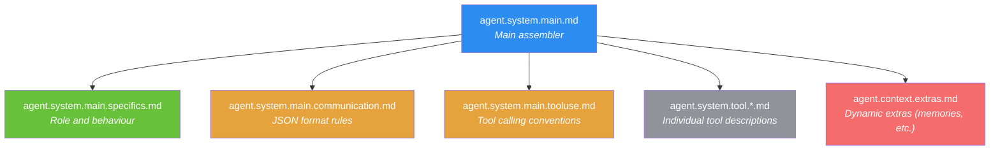

[← Home](../00-Home.md) | [↑ README](../README.md)


# Prompt System

## Overview

Agent Zero's behaviour is **entirely controlled by prompts**. Every instruction the agent follows, every tool description, every communication format — all defined in markdown prompt files. Change the prompts, change the agent.

## Prompt Location

| Location | Persisted? | Purpose |
|----------|:----------:|---------|
| `/a0/prompts/` | ❌ | Framework default prompts — **DO NOT EDIT** |
| `/a0/usr/prompts/` | ✅ | User global prompt overrides |
| `/a0/usr/agents/<profile>/prompts/` | ✅ | Per-profile prompt overrides |
| `<project>/.a0proj/prompts/` | ✅ | Per-project prompt overrides |
| `<project>/.a0proj/agents/<profile>/prompts/` | ✅ | Per-project per-profile overrides (highest priority) |

## ⚠️ The Override Convention

> **Never edit files in `/a0/prompts/` directly.** They will be **destroyed on update**.
>
> Instead, copy the prompt file to the appropriate override location and edit the copy.
> The resolution chain ensures your override is found first.

## Resolution Chain

When `agent.read_prompt("agent.system.main.role.md")` is called, files are searched in order (**first match wins**):

1. `<project>/.a0proj/agents/<profile>/prompts/` — project-scoped, profile-specific
2. `<project>/.a0proj/prompts/` — project-scoped, global
3. `usr/agents/<profile>/prompts/` — user-scoped, profile-specific
4. `agents/<profile>/prompts/` — framework defaults, profile-specific
5. `usr/prompts/` — user-scoped, global
6. `prompts/` — framework defaults (root)

The root `prompts/` folder provides defaults for **all** profiles.

## Prompt Assembly

The main system prompt is `prompts/agent.system.main.md`, which includes sub-prompts via:

```
{{ include "filename.md" }}
```

This creates a composable prompt hierarchy:



## Key Prompt Files

| File | Purpose |
|------|---------|
| `agent.system.main.md` | Main system prompt assembler |
| `agent.system.main.specifics.md` | Role definition and behaviour rules |
| `agent.system.main.communication.md` | JSON response format and rules |
| `agent.system.main.tooluse.md` | Tool calling conventions |
| `agent.system.main.role.md` | Profile-specific role (agent0 only) |
| `agent.system.main.environment.md` | Environment context (hacker only) |
| `agent.system.tool.response.md` | Response tool instructions |
| `agent.context.extras.md` | Dynamic context renderer |

## Dynamic Content

The assembled prompt is **dynamic** — it changes each loop iteration based on:

- Active agent profile
- Plugin system prompt extensions
- Recalled memories (injected into extras)
- Active project context
- `.promptinclude.md` files from working directory
- Available tools list

## `.promptinclude.md` Files

Any `*.promptinclude.md` file in the working directory is **auto-injected** into the system prompt every turn. These persist across conversations.

```bash
# Create a persistent instruction
workdir $ cat > dev-environment.promptinclude.md << 'EOF'
# Dev Environment
SSH to devpod: ssh agent-zero-dev
Codebase: /a0/usr/projects/agentzero/a0/
EOF
```

> **Critical:** Preference changes must be persisted to file before responding — never just acknowledge verbally. Always use `text_editor:write` or `behaviour_adjustment` for persistence.

## Related Pages
- [Agent Loop](../01-Architecture/Agent-Loop.md) — Where prompts are injected each iteration
- [Profile Guide](../02-Agent-Profiles/Profile-Guide.md) — Profile-specific prompt resolution
- [Project Context](../01-Architecture/Project-Context.md) — `.promptinclude.md` auto-injection
- [Settings](../07-Configuration/Settings.md) — Settings that affect prompt assembly
