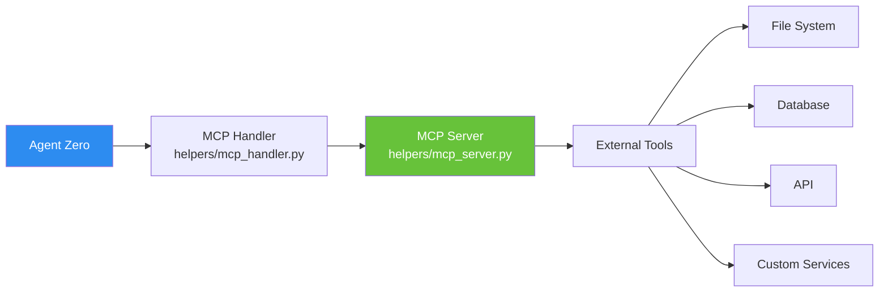
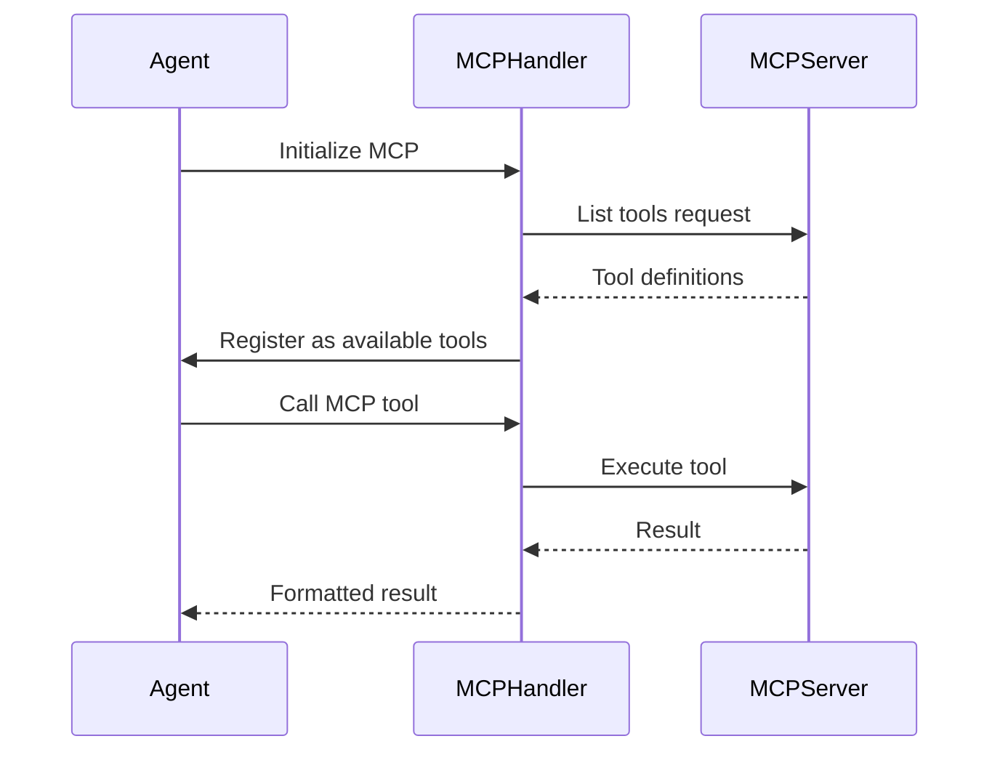

[← Home](../00-Home.md) | [↑ README](../README.md)


# MCP Integration (Model Context Protocol)

## Overview

Agent Zero supports **Model Context Protocol (MCP)** for connecting to external tool servers. MCP provides a standardized way for agents to access external capabilities through a protocol that LLMs can understand natively.



## Architecture

Agent Zero implements both **client** and **server** sides of MCP:

| Component | File | Purpose |
|-----------|------|---------|
| MCP Handler | `helpers/mcp_handler.py` | Client-side — discovers and calls MCP tools |
| MCP Server | `helpers/mcp_server.py` | Server-side — exposes Agent Zero tools via MCP |

## How MCP Tools Appear

When an MCP server is connected, its tools are **dynamically registered** and appear alongside built-in tools:

- Tools show up in the tool list with `mcp_` prefix
- The agent can call them like any other tool
- Results are returned in standard format

## Configuration

MCP servers are configured in settings:

```json
{
    "mcp_servers": {
        "filesystem": {
            "command": "npx",
            "args": ["-y", "@modelcontextprotocol/server-filesystem", "/path"],
            "transport": "stdio"
        },
        "remote-api": {
            "url": "http://mcp-server:3000/mcp",
            "transport": "sse"
        }
    }
}
```

### Transport Types

| Transport | Description |
|-----------|-------------|
| `stdio` | Local process communication via stdin/stdout |
| `sse` | Server-Sent Events over HTTP |

## Tool Discovery



## Built-in MCP Support

The MCP integration is provided by the core helpers:

- `helpers/mcp_handler.py` (46KB) — Full MCP client implementation
- `helpers/mcp_server.py` (17KB) — MCP server for exposing Agent Zero tools

## Adding Custom MCP Servers

1. **Configure** in `settings.json` under `mcp_servers`
2. **Install** the MCP server package if needed
3. **Restart** Agent Zero to connect
4. **Verify** tools appear via the tool list

## Use Cases

| Use Case | Example MCP Server |
|----------|-------------------|
| File system access | `@modelcontextprotocol/server-filesystem` |
| Database queries | Custom Postgres MCP server |
| API integration | Custom REST API MCP server |
| Git operations | `@modelcontextprotocol/server-github` |
| Web scraping | Custom browser MCP server |

## Related Pages
- [Tools Reference](../06-Tools/Tools-Reference.md) — Native Agent Zero tools
- [Plugin Architecture](../03-Plugins/Plugin-Architecture.md) — Plugins can wrap MCP servers
- [Settings](../07-Configuration/Settings.md) — MCP server configuration
- [Docker Setup](../08-Deployment/Docker-Setup.md) — Running MCP servers alongside Agent Zero
