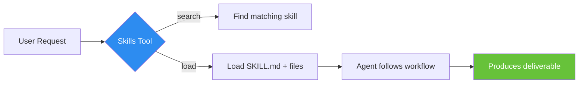

[← Home](../00-Home.md) | [↑ README](../README.md)


# Skills System

## Overview

Skills are **structured workflow packages** that guide the agent through complex multi-step tasks. Unlike tools (which are single atomic operations), skills provide **instructions, templates, and workflow definitions** that the agent follows to produce a deliverable.



## Skill Directory Structure

```
skills/<skill-name>/
├── SKILL.md              # Skill definition (required)
├── workflow.yaml          # Workflow steps (optional)
├── templates/             # Output templates (optional)
│   └── *.md
├── workflows/             # Detailed workflow files (optional)
│   ├── full-scan.yaml
│   └── deep-dive.yaml
└── references/            # Reference docs (optional)
    └── *.md
```

## SKILL.md Format

The SKILL.md file is the entry point for every skill. It contains:

```yaml
---
name: skill-name
description: What this skill does
version: 1.0.0
tags: ["tag1", "tag2"]
trigger_patterns:
  - "natural language trigger"
  - "another trigger"
---

# Skill Title

Instructions for the agent to follow...
```

### Key Fields

| Field | Required | Purpose |
|-------|:--------:|---------|
| `name` | ✅ | Skill identifier |
| `description` | ✅ | Brief description for matching |
| `version` | ❌ | Semantic version |
| `tags` | ❌ | Keywords for search matching |
| `trigger_patterns` | ❌ | Natural language phrases that trigger this skill |

## Skill Resolution

Skills are loaded at three levels:

1. **Framework:** `skills/` — built-in skills
2. **User:** `usr/skills/` — custom user skills
3. **Plugin:** `plugins/<plugin>/skills/` — plugin-provided skills

## skills_tool Operations

| Method | Description |
|--------|-------------|
| `skills_tool:search` | Find skills matching keywords or trigger phrases |
| `skills_tool:list` | List all available skills |
| `skills_tool:load` | Load a specific skill by name |

### Search Example

```json
{
    "tool_name": "skills_tool",
    "tool_args": {
        "method": "search",
        "query": "create a plugin"
    }
}
```

### Load Example

```json
{
    "tool_name": "skills_tool",
    "tool_args": {
        "method": "load",
        "skill_name": "a0-create-plugin"
    }
}
```

## Built-in Skills

| Skill | Purpose |
|-------|---------|
| `a0-create-plugin` | Guided plugin creation |
| `a0-contribute-plugin` | Publish to Plugin Hub |
| `a0-review-plugin` | Plugin quality review |
| `a0-debug-plugin` | Plugin debugging |
| `a0-manage-plugin` | Plugin lifecycle management |
| `a0-plugin-router` | Route plugin-related requests |
| `a0-development` | Development workflow |
| `a0-setup-cli` | CLI connector setup |
| `create-skill` | Create a new skill |

## Creating Custom Skills

1. Create directory: `usr/skills/my-skill/`
2. Write `SKILL.md` with frontmatter and instructions
3. Optionally add `workflow.yaml`, `templates/`, `references/`
4. Skill is automatically discoverable via `skills_tool:search`

## Skills vs Tools vs Plugins

```mermaid
graph TD
    Q{"Need to...?"} -->|Add new capability| P[Write a Plugin]
    Q -->|Guide multi-step task| S[Write a Skill]
    Q -->|Single atomic operation| T[Write a Tool]

    P --> P1[Plugin provides:<br/>extensions, API, tools, prompts]
    S --> S1[Skill provides:<br/>SKILL.md, workflow, templates]
    T --> T1[Tool provides:<br/>Python class with execute()]

    style P fill:#2d8cf0,color:#fff
    style S fill:#67c23a,color:#fff
    style T fill:#e6a23c,color:#fff
```

## Related Pages
- [Plugin Architecture](../03-Plugins/Plugin-Architecture.md) — Plugins vs Skills vs Tools distinction
- [Tools Reference](../06-Tools/Tools-Reference.md) — Full tool catalog
- [Knowledge System](../05-Memory-and-Knowledge/Knowledge-System.md) — Skills can leverage knowledge files
- [Scheduler](../06-Tools/Scheduler.md) — Scheduled tasks can invoke skills
